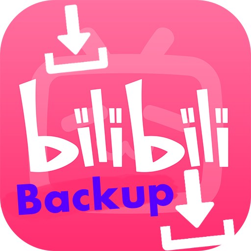

<a name="readme-top"></a>

<!-- PROJECT SHIELDS -->

[![Contributors][contributors-shield]][contributors-url]
[![Forks][forks-shield]][forks-url]
[![Stargazers][stars-shield]][stars-url]
[![Issues][issues-shield]][issues-url]
[![MIT License][license-shield]][license-url]

<!-- PROJECT LOGO -->
<br />
<div align="center">
  <a href="https://github.com/kingwingfly/fav">
    
  </a>

<h3 align="center">fav</h3>

  <p align="center">
    Back up your favorite bilibili resources with CLI.
    <br />
    <a href="https://github.com/kingwingfly/fav"><strong>Explore the docs »</strong></a>
    <br />
    <br />
    <a href="https://github.com/kingwingfly/fav">View Demo</a>
    ·
    <a href="https://github.com/kingwingfly/fav/issues">Report Bug</a>
    ·
    <a href="https://github.com/kingwingfly/fav/issues">Request Feature</a>
  </p>
</div>

<!-- TABLE OF CONTENTS -->
<details>
  <summary>Table of Contents</summary>
  <ol>
    <li>
      <a href="#about-the-project">About The Project</a>
      <ul>
        <li><a href="#built-with">Built With</a></li>
      </ul>
    </li>
    <li>
      <a href="#getting-started">Getting Started</a>
      <ul>
        <li><a href="#prerequisites">Prerequisites</a></li>
        <li><a href="#compilation">Compilation</a></li>
      </ul>
    </li>
    <li><a href="#usage">Usage</a></li>
    <li><a href="#roadmap">Roadmap</a></li>
    <li><a href="#contributing">Contributing</a></li>
    <li><a href="#license">License</a></li>
    <li><a href="#contact">Contact</a></li>
    <li><a href="#acknowledgments">Acknowledgments</a></li>
  </ol>
</details>

<!-- ABOUT THE PROJECT -->

## About The Project

[![Product Name Screen Shot][product-screenshot]](https://github.com/kingwingfly/fav)

Back up your favorite bilibili online resources with CLI.

<p align="right">(<a href="#readme-top">back to top</a>)</p>

### Built With

- [![Rust][Rust]][Rust-url]

<p align="right">(<a href="#readme-top">back to top</a>)</p>

<!-- GETTING STARTED -->

## Getting Started

### Prerequisites

- Install Rust
  ```sh
  curl --proto '=https' --tlsv1.2 -sSf https://sh.rustup.rs | sh
  ```
  You may need add some dependencies for protobuf yourself.

### Compilation

1. Clone the repo
   ```sh
   git clone https://github.com/kingwingfly/fav.git
   ```
2. Compilation
   ```sh
   cargo build --release
   ```

<p align="right">(<a href="#readme-top">back to top</a>)</p>

<!-- USAGE EXAMPLES -->

## Usage

Need `ffmpeg` usable, and able to be directly called in cli.

```
$ fav -h
Fav's CLI, helping persist the remote source. Repo: https://github.com/kingwingfly/fav

Usage: fav <COMMAND>

Commands:
  init        Initialize the folder for fav
  auth        Login your account
  fetch       Fetch from remote
  status      Show status of local, default to show resource status
  track       Track a remote source
  untrack     Untrack a remote source
  pull        Pull remote resource to local
  daemon      Interval fetch and pull
  completion  Completions for the shell
  help        Print this message or the help of the given subcommand(s)

Options:
  -h, --help     Print help
  -V, --version  Print version
```

### Steps

1. Init and Login first
2. Fetch the favorite sets(lists)
3. Track the list_id you want. You can see them through `fav status -s`
4. Fetch tracked resources
5. Pull the resources

### Example

```sh
# auto complete is supported; i.e. fish
$ fav completion fish > ~/.config/fish/completions/fav.fish
# init for bilibili
$ fav init
# scan code to login
$ fav auth login
# fetch favorite list
$ fav fetch
# show status
$ fav status -s
# track list
$ fav track <list_id>
# fetch and pull videos
$ fav pull
# untrack list or video
$ fav untrack <list_id/bvid>
# daemon
$ fav daemon 30
```

_For more examples, please refer to the [Documentation](https://github.com/kingwingfly/fav)_

<p align="right">(<a href="#readme-top">back to top</a>)</p>

<!-- ROADMAP -->

## Roadmap

- [x] Init
- [x] Auth
- [x] Fetch
- [x] Status
- [x] Track
- [x] Untrack
- [x] Pull
- [ ] Dynamic completion

See the [open issues](https://github.com/kingwingfly/fav/issues) for a full list of proposed features (and known issues).

<p align="right">(<a href="#readme-top">back to top</a>)</p>

<!-- CONTRIBUTING -->

## Contributing

Contributions are what make the open source community such an amazing place to learn, inspire, and create. Any contributions you make are **greatly appreciated**. Moreover, it is recommended to open an issue before coding to avoid repeated and useless work.

If you have a suggestion that would make this better, please fork the repo and create a pull request. You can also simply open an issue with the tag "enhancement".
Don't forget to give the project a star! Thanks again!

<p align="right">(<a href="#readme-top">back to top</a>)</p>

<!-- LICENSE -->

## License

Distributed under the MIT License. See `LICENSE.txt` for more information.

<p align="right">(<a href="#readme-top">back to top</a>)</p>

<!-- CONTACT -->

## Contact

Louis - 836250617@qq.com

Project Link: [https://github.com/kingwingfly/fav](https://github.com/kingwingfly/fav)

<p align="right">(<a href="#readme-top">back to top</a>)</p>

<!-- ACKNOWLEDGMENTS -->

## Acknowledgments

- [bilibili-API-collect](https://github.com/SocialSisterYi/bilibili-API-collect)

<p align="right">(<a href="#readme-top">back to top</a>)</p>

<!-- MARKDOWN LINKS & IMAGES -->
<!-- https://www.markdownguide.org/basic-syntax/#reference-style-links -->

[contributors-shield]: https://img.shields.io/github/contributors/kingwingfly/fav.svg?style=for-the-badge
[contributors-url]: https://github.com/kingwingfly/fav/graphs/contributors
[forks-shield]: https://img.shields.io/github/forks/kingwingfly/fav.svg?style=for-the-badge
[forks-url]: https://github.com/kingwingfly/fav/network/members
[stars-shield]: https://img.shields.io/github/stars/kingwingfly/fav.svg?style=for-the-badge
[stars-url]: https://github.com/kingwingfly/fav/stargazers
[issues-shield]: https://img.shields.io/github/issues/kingwingfly/fav.svg?style=for-the-badge
[issues-url]: https://github.com/kingwingfly/fav/issues
[license-shield]: https://img.shields.io/github/license/kingwingfly/fav.svg?style=for-the-badge
[license-url]: https://github.com/kingwingfly/fav/blob/master/LICENSE.txt
[product-screenshot]: images/screenshot.png
[Rust]: https://img.shields.io/badge/Rust-000000?style=for-the-badge&logo=Rust&logoColor=orange
[Rust-url]: https://www.rust-lang.org
